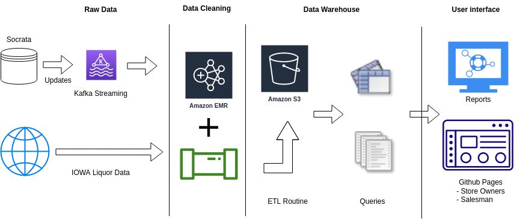

# <u> CMPT 732 Big Data Project Report</u> -> [Link](https://pages.github.sfu.ca/sna101/3_datamen_CMPT_732_project/project_report)

## Problem definition: 
*What is the problem that you are trying to solve? What are the challenges of this problem?*

When any business owner decides to open a new store(or expanding an existing business) at new city or a new neighbourhood, It can be challenging for business owners to decide on the best location/products for their stores so that they can make more profits.

Also, when a Vendor salesmen approach business owners  asking them to keep/sell their products. A good analysis is need to check how theses products are doing in the market for that city.

Analysis on above questions is necessary to take decisions such as the optimal location for their business,  what products they will sell, and how to increase sales when starting a new or
expanding an existing business in a new city.

Therefore, by examining the past sales data, our
initiative intends to provide analysis on above mentioned questions to inform them with knowledge that can assist them in making profitable decisions.

Now, we plan to test the this strategy on the *["Liquor sales"](https://data.iowa.gov/Sales-Distribution/Iowa-Liquor-Sales/m3tr-qhgy)* dataset presented by Iowa Govt. 

Also, the above strategy can be extended to provide these analysis to stores in other domains.
For example, if Safeway plans to open a new store in a new city, we can provide them with answers to above questions and help them maximize their profits.

## Methodology: 
*What is the problem that you are trying to solve? Briefly explain which tool(s)/technique(s) were used for which task and why you chose to implement that way.*

As we mentioned, we used *["IOWA Liquor sales data"](https://data.iowa.gov/Sales-Distribution/Iowa-Liquor-Sales/m3tr-qhgy)* published by IOWA Government.
Now, after obtaining the data, the next task was to clean it, extract-transform-load it into a Data Warehouse and then eventually into a Data Mart, and then generate reports like grouping the most popular drink by region. And the final stage i.e. to visualize the data and make it presentable to the clients.

 1. **Brief on Data Acquiring and Cleaning**

    The Iowa Alcoholic Beverages Division receives reports on wholesale transactions, and they make the data (from 2012 to the present) accessible at: [https://data.iowa.gov/](https://data.iowa.gov/Sales-Distribution/Iowa-Liquor-Sales/m3tr-qhgy).

    For the main data source is a 5.7 GB file iowa-liquor. Through analysis, we found that this table contains store information, product information and transaction information. Among them, there are a lot of redundant and wrong data in the store data, such as information loss, multiple names for the same store, etc. In addition, the geographical location is stored as coordinate point data instead of latitude and longitude, and there are errors in the date format. 

    In order to facilitate analysis and remove redundant and erroneous data, we use the official store table and product table to replace the original data(by drop the columns from iowa-liquor). In this way, while proofreading the data, it also normalizes the data. After solving all the mentioned problems, the data becomes three tables of sale, store and product. Each table can be updated individually via Kafka in real-time. It is convenient for subsequent analysis and mining.

2. **Overview of History Sale Data and Its Trend**

    Before we dive into any deeper analysis, we would like to have an overview of the history sale data, and see whether there is a particular pattern of how the total sale changes.

    By using Spark we aggregated the sales data by year and month, and we found there obviously is a pattern: the amount of sale changes in similar way within each year, and the overall trend is steadily increasing.

    Check More Details here: [README.md](https://github.sfu.ca/sna101/3_datamen_CMPT_732_project/tree/main/src/Overview_Sale_By_Month#overview-of-history-sale-data-and-its-trend)

3. **Some Questions we intend to answer**

    [**Question 1.**](https://github.sfu.ca/sna101/3_datamen_CMPT_732_project/tree/main/src/growth_rate#variance-of-growth-rate-under-different-market-segmentation)
    
    **(a)** Market can be segmented in different ways, for example: by cities, mid-to-high-end liquors, liquor categories, and so on; sales growth rate of market segments under each of these scenarios may have different distributions. We would like to explore which of the scenarios can divide the market most effectively, that is, to reveal the variantion of different market segments, so that vendors can know what to take into consideration when they want to expand their business

    **(b)** Display growth rate distributions under the Top 5 segmentation scenarios

    [**Question 2.**](https://github.sfu.ca/sna101/3_datamen_CMPT_732_project/tree/main/src/Q2_RFM_Cluster#describe-and-classify-the-store-using-rfm-model)

    **(a)** Clustering based upon Geographical location i.e. either based on Gps coordinates or zipcodes.

    **(b)** Correlation analysis (coeff -1 ～ 1), to explore substitutes and complements (store level)

    [**Question 3.**](https://github.sfu.ca/sna101/3_datamen_CMPT_732_project/tree/main/src/Q3_Optimization_problem#optimizing-profit)

     Assuming that the capital at hand is certain, how can we try to maximize the profit? I.e.  finding Capital turnover rate /Wine inventory which means The more frequently you buy, the higher the capital turnover rate (Optimization problem)

#### Proposed Solution Design:

## Problems: 
*What problems did you encounter while attacking the problem? How did you solve them?*

- ### Analysing the Big Table
    One of the fist issues we faced was loading and analysing the main table present in the database. As it contained only one table that too with 23 columns, it was a little difficult to fully understand the data before we perform any sort of analysis on it. Therefore, we normalized the data into 3 tables sales, store and product which can be consumed individually real-time, and is convenient for subsequent analysis and mining. 

- ### Dealing with New Data
   In this project we are analysing the old historic data to analyse the past trends regarding the sales of the product. But what about the new data which keeps getting generated everyday. Let's say we run this analysis after a week we might want to consider the last week's data as well in that analysis and for that we cannot clear and reload the whole database. Therefore, we added a script for Kafka streaming which would keep checking the data-set website every night and if it finds a new range of data it streams the data using **Kafka** and updates/appends our database with new rows, which can be used in next analysis.

## Results: 
*What are the outcomes of the project? What did you learn from the data analysis? What did you learn from the implementation?*

- Problem 1: What Are the Most Effective Market Segmentation Scenarios?

    Using a single feature as the segmentation scenario usually won't incur a large variation among different segments. The segmentation scenario that causes the largest variance is "city + category + grade", while other several scenarios followed closely behind also performe well. Vendors should take the top several scenarios into consideration and get a look in depth into different segments under them.

    Check More Details here: [README.md](https://github.sfu.ca/sna101/3_datamen_CMPT_732_project/tree/main/src/Q1_Growth_Rate#results)

- Problem 2: Describe and Classify the current stores with respect to  using RFM model

    Through analysis, we found that traditional retail analysis methods can be used to analyze merchants.
At the same time, we found that the features obtained by using RFM can classify merchants very well.
These classifications directly reflect the simple and direct business logic on the map. Good businesses are located in densely populated areas with convenient transportation and are relatively concentrated.
Using this conclusion, we can help merchants make better site selection, and at the same time, for winery sales staff, they can also help them better locate the top customer groups.

    Check More Details here: [README.md](https://github.sfu.ca/sna101/3_datamen_CMPT_732_project/tree/main/src/Q2_RFM_Cluster#result)

- Problem 3: Describe and Classify the store using RFM model

    We found that Products like "HA last DROP Scotch" and "Remy Martin Louis" can give profit upto USD 1000 per bottle.
And selling just 100s of these bottles can give profit of atleast USD 100,000 in just 3 months.

    Check More Details here: [README.md](https://github.sfu.ca/sna101/3_datamen_CMPT_732_project/tree/main/src/Q3_Optimization_problem#results)

## [Project Summary](https://coursys.sfu.ca/2022fa-cmpt-732-g1/pages/ProjectSummary): 
*A summary of what you did to guide our marking.*

- Getting the data: Acquiring/gathering/downloading.
- ETL: Extract-Transform-Load work and cleaning the data set.
- Problem: Work on defining problem itself and motivation for the analysis.
- Algorithmic work: Work on the algorithms needed to work with the data, including integrating data mining and machine learning techniques.
- Bigness/parallelization: Efficiency of the analysis on a cluster, and scalability to larger data sets.
-  UI: User interface to the results, possibly including web or data exploration frontends.
      * We used the Github Pages and Github CI/CD pipleine to create this website to host our report and User interface to result of our analysis and Visualizations.
- Visualization: Visualization of analysis results.
      * We used Matplotlib python package and Orange Data Mining to plot a lot of charts to demonstrate the result of our analysis, such as scatter plot, bar charts and line charts.Instances of these can be found in the report and "README.md" of each problem.
- Technologies: New technologies learned as part of doing the project. 
    * A few technologies we learned and used while completing this project are Orange Data Mining, Amazon S3, Python Spark, Amazon AWS EC2, Socrata, Matplotlib, Github Pages, Kafka streaming, Parquet file format.

