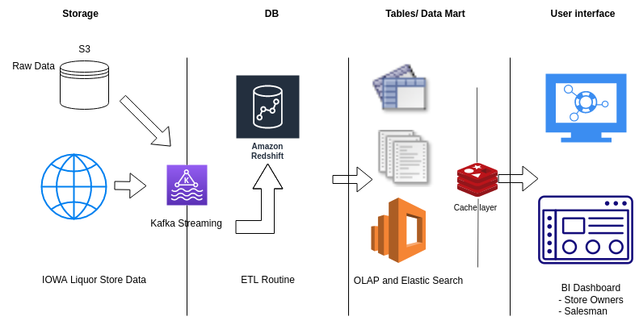

#
CMPT 732 Big Data Project

## Problem definition: 
What is the problem that you are trying to solve? What are the challenges of this problem?

It can be challenging for business owners to decide on the best location for their
stores, the products they will sell, and how to increase sales when starting a new or
expanding an existing business in a new city.
Therefore, by examining the open data set assembled by the government, our
initiative intends to inform them with knowledge that can assist them in making
decisions.

We plan to test this strategy on the Liquor sales dataset presented by Iowa Govt
Website. After obtaining the data, we will need to clean it, extract-transform-load it into a Data Warehouse and then eventually into a Data Mart, and then generate reports like grouping the most popular drink by region. And the final stage will be to visualize the data and make it presentable to the clients.

## Methodology: 
What is the problem that you are trying to solve? Briefly explain which tool(s)/technique(s) were used for which task and why you chose to implement that way.

## Problems: 
What problems did you encounter while attacking the problem? How did you solve them?
## Results: 
What are the outcomes of the project? What did you learn from the data analysis? What did you learn from the implementation?
## Project Summary: 
A summary of what you did to guide our marking. 
