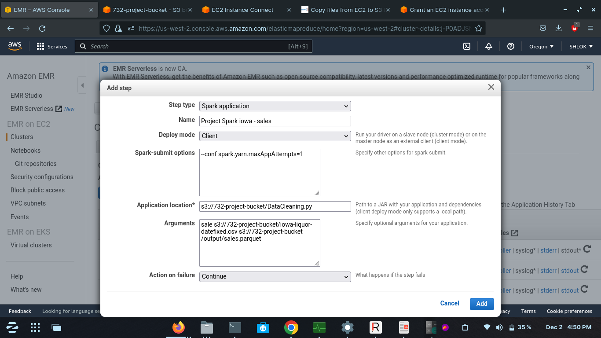
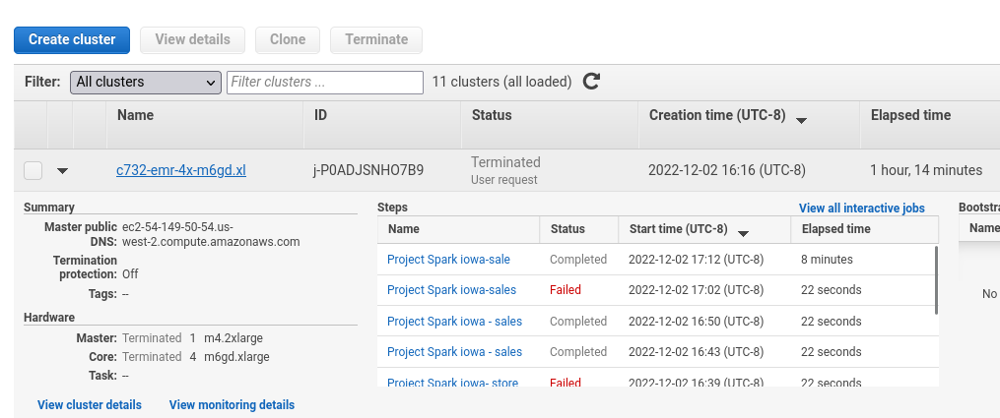
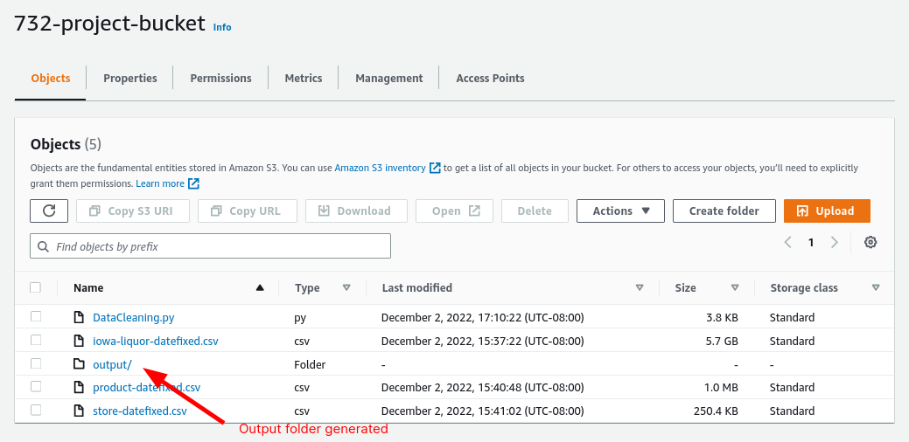

# Data Cleaning

The iowa-liquor dataset is a 5.7 GB file. Through analysis, we found that this table contains store information, product information and transaction information. Among them, there are a lot of redundant and wrong stores data, such as incomplete names, multiple names for the same store, etc. In addition, the geographical location is stored as coordinate point data instead of latitude and longitude, and there are errors in the date format. 

In order to facilitate analysis and remove redundant and erroneous data, we used the official store table and product table to replace the original data(by dropping the columns from original Table). In this way, while proofreading the data, it also normalized the data. After solving all the mentioned problems, the data normalizes into three tables namely sale, store and product. Each table can be updated individually via Kafka in real-time. It is convenient for subsequent analysis and mining.

We performed this data cleaning action on Amazon EMR.

Which downloads the data from the official site, cleans the data(using DataCleaning.py) and then the cleaned data is moved back to our amazon S3 bucket(732-project-bucket)

