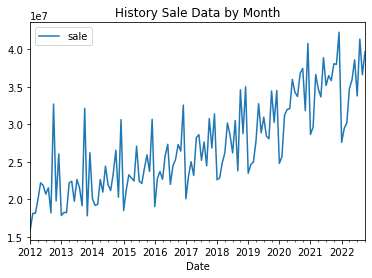
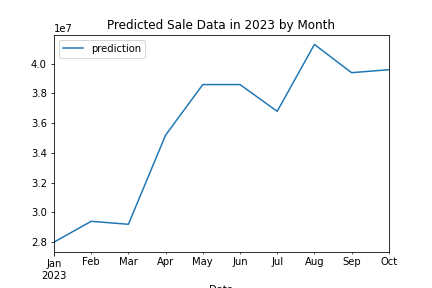

# Overview of History Sale Data and Its Trend

Before we dive into any deeper analysis, we would like to have an overview of the history sale data, and see whether there is a particular pattern of how the total sale changes.

By using Spark to aggregate the sale by year and month, the below curve can be plotted:

There's obviously a pattern: the amount of sale changes in similar way within each year, and the overall trend is steadily increasing. 

Therefore, we are also interested in using some machine learning model to forecast next year's monthly total sale. We used a SQLTransformer to get total sale of same month in last year, by joining the DataFrame with itself. And then we assembled year, month of year, and total sale of same month in last year into a feature vector, and picked Gradient-Boosted Trees as the regressor, to construct a Spark Machine Learning pipeline. We trained the model using existing data, and got a r2 = 0.8286264488949292. Finally we used the model to predict total sale in 2023, and got the below curve:

