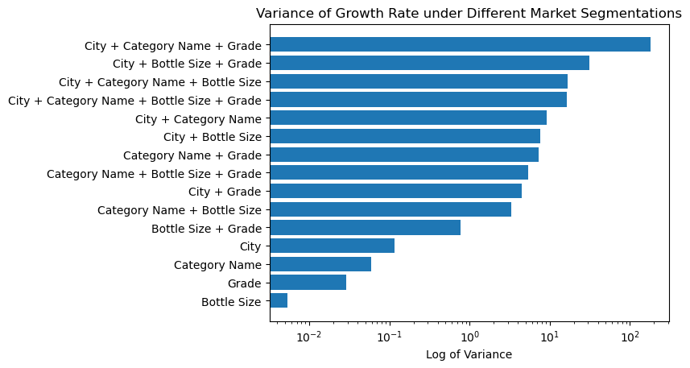
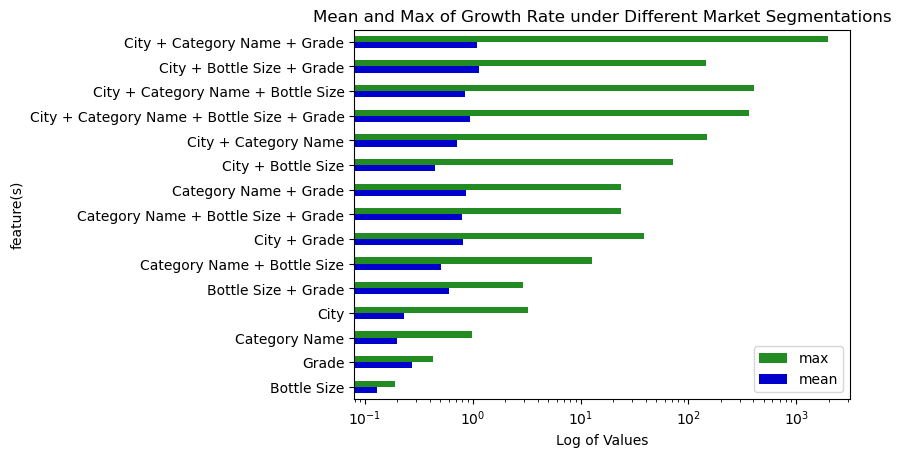
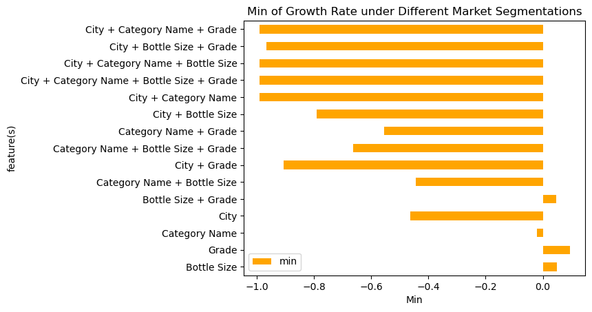

# Variance of Growth Rate under Different Market Segmentations

## Problem

A market may roughly have four stages: when it is introduced at the first time, it grows slowly; later after the business model is proven to be practical
or the product is favoured by customers, it can grow rapidly; but it cannot keep growing forever, because the demand is not infinite. So when the supply
and demand reached a balance, the market can get into a "mature" stage. Some can remain at this stage for a quite long time, while others may soon be
behind the times and thus start to decline.

Therefore, vendors may care about which market segments are growing fast or have the potential to grow.
For example, if we divide the market by city, city A's liquor market may have been growing slowly for years
while city B's may be growing fast. Then it will be more likely for a vendor to be willing to get into the market segment of city B.
This may give some insights to vendors on where to expand their business and where to avoid.
However, market can be segmented in a variety of ways, for example, by city, by category, by grade (low to high end),
by bottle size, and also by the combinations of them such as by city-and-category, by city-and-grade, etc.
Growth rates of segments created by using some of the segmentation scenarios may not vary a lot so that can only produce few suggestions, 
while that under some other segmentation scenarios may do. Therefore, we are interested in "which
scenarios of segmenting the market can reveal the variation of growth rates", to give vendors some directions on
what to take into consideration.

## Analysis

To find the most effective scenarios, we first prepare some candidate scenarios which are potentially able to divide the market:

- city (existing)

- category (existing)

- grade: generated by firstly calculating the price per milliliter for each product, and divide them into low-, mid-, high-end product according to the distribution of unit prices

- bottle size: similar to grade, generated by dividing products into small, mid, large size according to their bottle volume

- and all combinations of them

We preprocess the data to extract these features in such a way: firstly load each table separately (sales, product, store). For product data, extract category name, calculate the price per milliliter, get the mean and variance of the unit price computed, and assgin each of them a "grade" from {'low', 'mid', 'high'}, and also assign each of them a "size" from {'s', 'm', 'l'} according to their bottle volumn. For store data, extract the city. And then we join the three tables together using the foreign keys in sales data.

With each combination as a segmentation senario, markets can be divided into
many different segments. For each market segment under each segmentation scenario, we would like to take its average growth rate 
of the most recent three years to indicate whether that market segment is growing, stagnate, or declining. 

This can be achieved using the algorithm below:

       $ For each segmentation scenario:
       $      Select out year, sale, and the features invovled in the scenario;
       $      Do self join on these conditions to get a new column "last year's sale" for each row: 
       $             1). each feature involved in the scenario matches (to gaurantee its the same segment);
       $             2). one part's "year" = the other part's "year" + 1; 
       $      Compute each year's growth rate by sale - last_year_sale;
       $      Aggragate groupBy the sceario on growth rate to get the average growth rate of past three years;
       $      Compute variance, mean, max, min among all segments created by this scenario;

All the indicators are appended to a list and then we use the list to create the resultant DataFrame, and save the result. Finally, we use Jupyter Notebook with matplotlib and Pandas to visualize the result.

## Results
Here are the variances of growth rates under different segmentation scenarios. The values have been scaled by log so that the graph won't be horizontally too long.

From the bar chart we can see that using a single feature as the segmentation scenario usually won't incur a large variation among different segments. This may because such a segmentation scenario is too general that the resultant market segments are high-level and may be all growing or declining. The most effective scenario for single feature is "city". This can also be proven by looking into the max, mean, and min bar chart below: there are cities with booming liquor market and also cities with dismal liquor market.

The segmentation scenario that causes the largest variance is "city + category + grade", with one segment growing super fast (see Jupyter Notebook for details), some growing fast, and some declining fast. Other several scenarios on its heels also performs well, effectively identifying growing and declining market segments. Vendors should definitly take the top several scenarios into consideration and get a look in depth into different segments under them.

The min graph is seperated from mean_max graph because there are many negative values in this graph, which can be easily overwhelmed when putting with max together. 

To help vendors get more insights, the intermediate DataFrames (containing growth rates of each segment under each scenario, divided into different folders by scenario) are kept, and we provide a Jupyter Notebook method to visualize them (see [**plot_growth.ipynb**](https://github.sfu.ca/sna101/3_datamen_CMPT_732_project/blob/main/src/Q1_Growth_Rate/plot_growth.ipynb))

