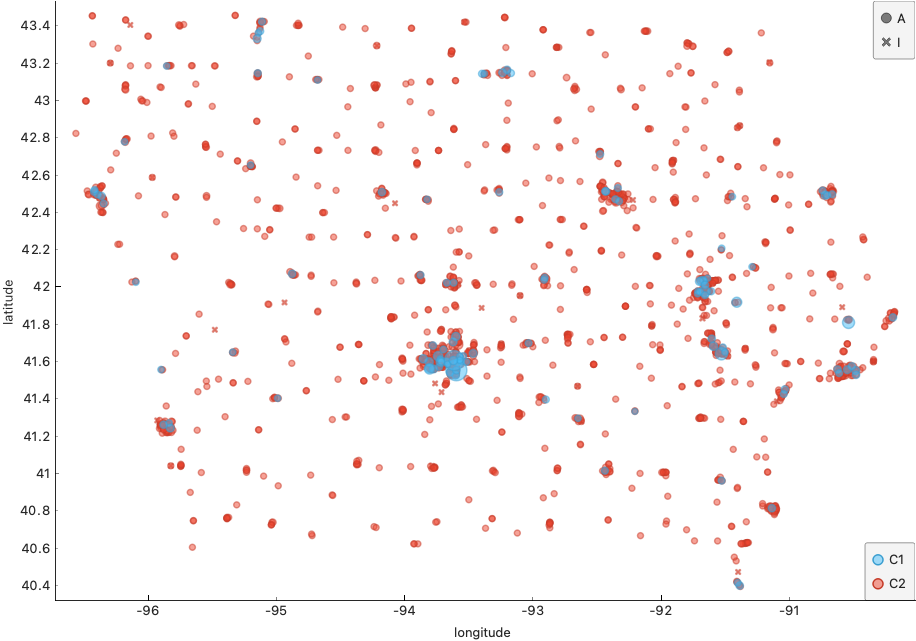
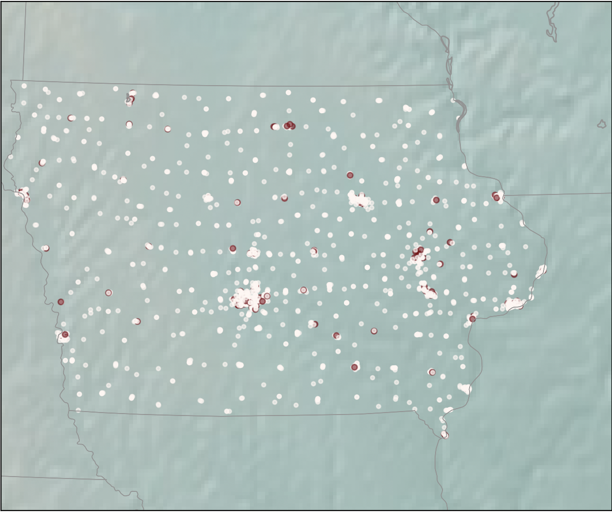
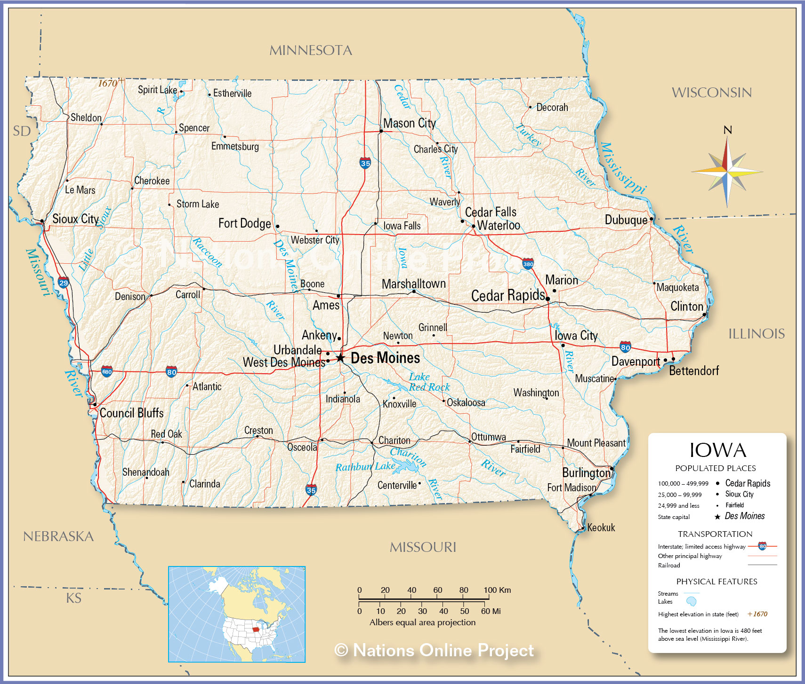

# Describe and Classify the store using RFM model

### Problem
We hope that there is a way to find the best wholesaler and find commercial value through further research.
RFM Segmentation is a great way to identify customer segments to be treated specially. People use this method to improve your customer marketing.
For the current dataset Iowa Liquor, Stores and Products. We were curious whether merchants could be described by using the classic models commonly used in the retail industry, and thus makes traditional analytical methods also works with those merchants.

### Result
At the beginning, we worry that since merchant purchase is a stable behavior, we do not know whether the Recently, field still has meaning before the analysis. After data processing, we use the RFM method to model the data.
Use the following steps:
First define and process the data:
Recently is simply the amount of time since the customer’s most recent transaction (most businesses use days, though for others it might make sense to use months, weeks or even hours instead).
Frequency is the total number of transactions made by the customer (during a defined period).
Monetary is the total amount that the customer has spent across all transactions (during a defined period).
We select the data of the most recent year as the defined period.

The second step is to divide the customer list into tiered groups for each of the three dimensions (R, F and M), using Pandas describe. Unless using specialized software, it's recommended to divide the customers into four tiers for each dimension, Such that each customer will be assigned to one tier in each dimension:
We use 25% 50% 75% points and others to divide different tiers.

Next, we use the k-means algorithm to try to classify according to these features, and display them on the graph to observe whether the classification has practical significance.
During the experiment, we found that the removal of any of the three groups of RFM features could not produce a good classification effect. It also proves that even if the merchant's purchase is a relatively stable behavior, his behavior can partially reflect the purchase characteristics of the consumer.
In the end, we found that dividing merchants into two categories worked best. Namely: good merchants and ordinary merchants

As the picture shows:

We can see that on the scatter plot, we can clearly feel that there is an obvious data aggregation in some positions and good merchants concentrated. These scattered points obviously reflect the information of geographical location and traffic arteries.
To prove this, we superimposed the scatter plot on the map to see that it is very close to our judgment. In order to reflect our hypothesis more clearly, we further took out the map of iowa for comparison. It can be seen that our conjecture is fully verified. Good merchants are mainly distributed in major cities, major traffic routes, and border cities of Iowa State. It can be seen that RFM can be used to describe iowa liquor merchants. This enables data consumers to generate more targeted policies. 

For example: the data results based on this can help merchants select locations, and help winery sales personnel to find the best target group for promotion and marketing.