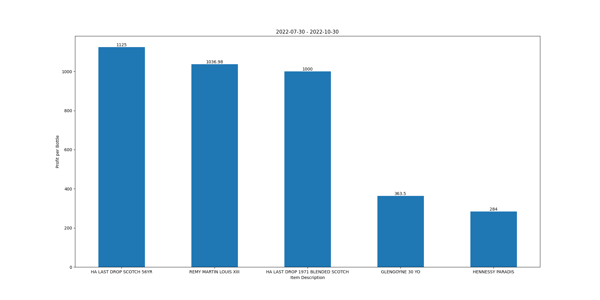
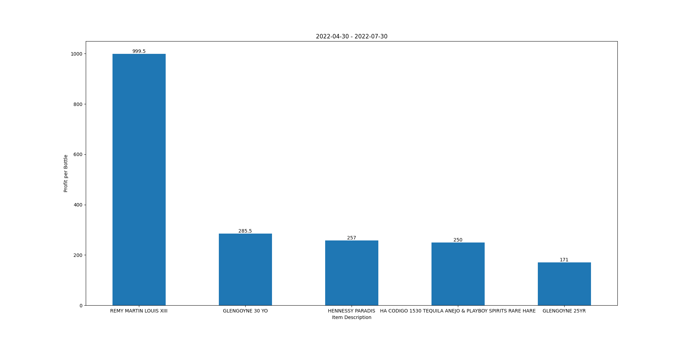
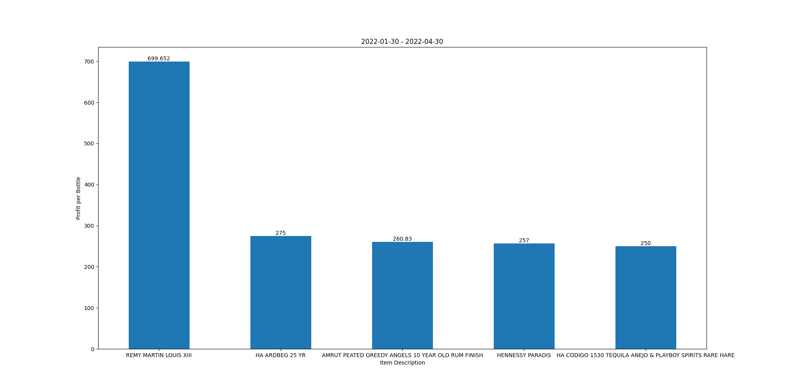

# Optimizing Profit

### Problem
Assuming that the capital at hand is certain, how can we try to maximize the profit? 

So, if the business owners has limited capital and limited inventory space which products would be the best ones to invest in or buy and keep in inventory. I.e to find the products that give maximum profits, at the same time, keeping in mind that the inventory space is limited. Therefore, optimizing both the constraints.

### Results

Here we try to find the list of top products of last 3 months which has maximum profit margin(sales price - retail price) and at the same time are sold faster than other products, therefore, giving the business owner maximum profit in less time, i.e. finding Capital turnover rate /Wine inventory which means The more frequently people buy, the higher the capital turnover rate.

As the price of products keep changing we run the analysis(each for 3 months) for multiple quarters which gives us best idea of best products to invest in.

We found that Products like "HA last  DROP Scotch" and "Remy Martin  Louis" can give profit upto **USD 1000** per bottle. 

Following Graph shows the top 5 products to invest in

- For period: 30/07/2022 - 30/10/2022

- For period: 30/04/2022 - 30/07/2022

- For period: 30/01/2022 - 30/04/2022

For Example:

For the period (30/07/2022 - 30/10/2022), We found that Products like "HA last drop Scotch" and "Remy Martin  Louis" can give profit upto **USD 1000** per bottle. selling just 100s of these bottles can give profit of atleast **USD 100,000** in just 3 months.

Also, it looks like irrespective of the price, "Remy Martin  Louis" appears in top 5 products for all 3 quarters which means it has been all time favourite as the same time it has maximum profit margin for business owners. Therefore, it looks like the best product to invest in.

