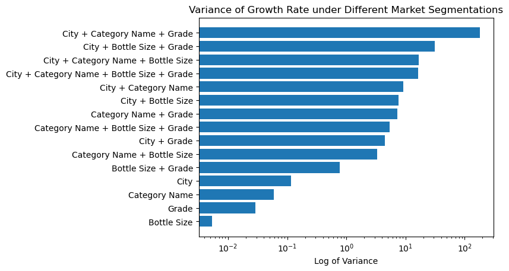
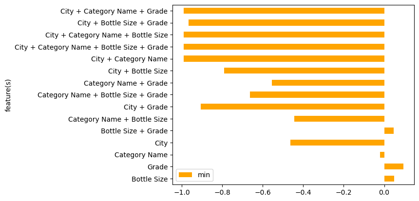
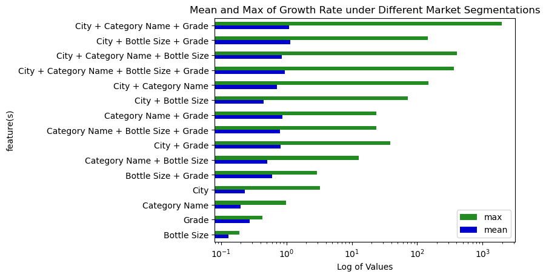

# Variance of Growth Rate under different market segmentation

## Problem

Vendors may care about which market segmentation are growing fast or which have the potential to grow.
For example, if we divide the market by city, city A's liquor market may have been growing slowly for years
while city B's is growing fast. This may give some insights to vendors on where to expand their business and where to avoid.
However, market can be segmented in a variety of ways, for example, by city, by category, by grade (low to high end),
by bottle size, and also by the combinations of them such as by city-and-category, by city-and-grade, etc.
Growth rates under some of the segmentation may not vary a lot so that cannot produce much
suggestions, while growth rates under some other segmentation may do. Therefore, we are interested in "which
scenarios of segmenting the market can reveal the variation of growth rate", to give vendors some directions on
what to take into consideration.

To find the most significant scenarios, we first prepare some candidate scenarios and we take the average growth rate 
of the most recent four years to indicate whether a certain market segmentation is growing. In this way we have some scenarios,
and under each of them some average growth rates (e.g., we have "city", "category", ..., and under "city", there are 
growth rates of Des Moines, Albia, Algona, etc). We then compute variance of top n growth rates under each scenario.
The more important a scenario is, the bigger its variance, and the more likely it's a good scenario to divide the market.
As for scenarios with small variances, the corresponding market segmentation are either all saturated or changing in the same pace, 
and we can see from the mean that at which stage it is.

Here are some potential scenarios: 
city (existing)
category (existing)
grade (will be generated by firstly calculating the price per litre for each product, 
       and divide them into low-, mid-, high-end product)
bottle size (similar to grade, will divide products into small, mid, large according to their bottle volume)
and all combinations of them

